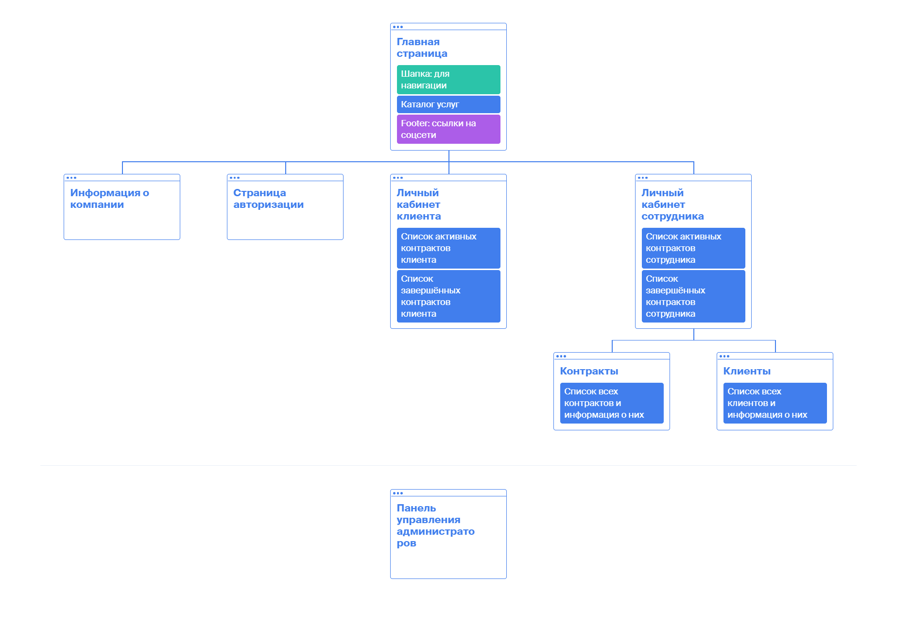

# Схема базы данных

# Схема навигации страниц

# Страницы приложения
### Главная страница
Шапка страницы
+ Кнопка для перехода на страницу регистрации или входа
+ Кнопка перехода на страницу информации о компании
+ Если пользователь авторизовался, то есть возможность перехода на страницу "личный кабинет"

Главная часть страницы
+ Каталог услуг, название вместе с описанием и ценами. Есть возможности фильтрации (например, отображение услуг в определённом интервале цен, есть возможность поиска услуг по названию), можно настроить порядок отображения услуг в каталоге (по популярности / по цене | по убыванию / по возрастанию). Авторизованный клиент может заказать услугу, выбрав нужную в каталоге услуг и нажав кнопку `оформить`
  
Внизу главной страницы (footer)
+ Информация о контактах фирмы (ссылки на соцсети) и адрес фирмы

### Страница информации о компании
Описывает компанию, её устройство и историю, лицензию на ведение юридической деятельности и другие юридические аспекты.

### Страница регистрации / входа
Для **регистрации** содержатся поля `имя`, `контактный телефон`, `email`, `логин` (здесь есть возможность позволить клиенту не придумывать логин, а использовать в качестве логина номер контактного телефон или адрес электронной почты), `пароль` и поле `подтверждение пароля`. Далее кнопка `регистрация`.

Для **авторизации уже существующей учётной записи** есть два поля: `логин` - в качестве логина используется контактный телефон или email и `пароль`. Далее кнопка `авторизация`.

### Страница личный кабинет клиента
*Эта страница доступна только тем, кто авторизовался как клиент.*

Наверху поля, отображающие информацию о клиенте, которые сам клиент может редактировать. Есть кнопка `удалить аккаунт`. Далее чуть ниже идёт список незаконченных контрактов, а ещё ниже список завершённых контрактов данного клиента.

### Страница личный кабинет сотрудника
*Эта страница доступна только тем, кто авторизовался как сотрудник или администратор.*

Наверху поля, отображающие информацию о сотруднике, которые сам сотрудник может редактировать. Далее список активных контрактов: то есть тех, которые оказывает данный сотрудник на данный момент. Активный контракт служащий может завершить. Внизу список завершённых контрактов данным сотрудником.

### Страница контракты
*Эта страница доступна только тем, кто авторизовался как сотрудник или администратор.*

На этой страницы отображаются все контракты всех клиентов. Отображаются поля название типа услуги (из каталога), дата начала, имя и логин клиента, который заказал данный контракт и несколько строк из описания контракта. Есть возможность настройки параметров отображения: например, контрактов, оказанных в определённый период времени, определёнными сотрудниками, определённым клиентам. Есть кнопка `новый контракт`, к которой прилагаются поля: логин клиента, участвующие сотрудники, тип услуги и описание контракта. У сотрудника для каждой активной услуги есть кнопка `заняться контрактом` или `перестать заниматься контрактом`. Для активной (незавершённой) услуги у сотрудников есть возможность редактирования информации о контракте, например, изменить его стоимость. Также у сотрудника есть кнопка `завершить контракт`, тогда контракт считается выполненым и отправляется в список завершённых контрактов.

### Страница клиенты
*Эта страница доступна только тем, кто авторизовался как сотрудник или администратор.*

Есть кнопка `зарегистрировать нового клиента`, которая нужна сотруднику для регистрации нового клиента и соответствующие поля: имя, логин, пароль, контактный телефон, email. Чуть ниже отображается список всех клиентов.  Отображется ФИО клиента, его контактный телефон, email и логин. Для каждого клиента есть возможность просмотреть те контракты, которые он заказывал. Служающие могут просматривать любую информацию о любом клиенте кроме его пароля. (Имя, логин, контактный телефон, email).

### Панель управления администраторов
*Эта страница доступна только администраторам.*

Кнопка регистрации нового клиента или служающего вместе с полями: имя, контактный телефон, email, логин, пароль, должность для сотрудника и есть ли привилегия администратора для сотрудника.

Есть полная возможность добавление / изменения / удаления любой информации о сотрудниках, клиентах, контрактах и услугах. Для этого на панели администратора есть возможность отобразить соответсвующие списки, есть возможности настройки параметров отображения и отредактировать все поля.

# Сценарии использования
Ниже приведены сценарии использования. Нашим сайтом будут пользоваться разные пользователи, их можно разделить на три категории, каждая категория имеет разные привелегии.

Администраторы базы имеют полный доступ ко всему, они могут просматривать / редактировать / удалять любую информацию о клиентах, сотрудниках и заказах.

Права клиентов и сотрудников фирмы планируется разграничивать с помощью учётных записей. Возможность создать аккаунт клиента есть у каждого, кто зайдёт на сайт. Возможность создать аккаунт сотрудника есть только у администратора.

### Примеры сценариев использования

**Для клиентов, зашедших на сайт**
+ Просмотр каталога услуг (не требует регистрации). Для этого просто заходим на главную страницу
+ Регистрация клиентом своего аккаунта. В шапке главной странице есть кнопка перехода на страницу регистрации или входа
+ Заказать новую юридическую услугу (требует регистрации). Для этого у зарегистрированных пользователей есть возможность выбрать услугу в каталоге услуг на главной странице и нажать кнопку `оформить`
+ Просмотреть информацию о всех предыдущих услугах своего акканута (требует регистрации). Нужно перейти с главной странице в личный кабинет пользователя, для этого у авторизированных пользователей в шапке главной страницы есть ссылка на страницу личного кабинета
+ Удаление клиентом своего аккаунта (требует регистрации). Для этого авторизированный клиент, зайдя в личный кабинет, нажимает кнопку `удалить аккаунт`

**Сотрудники**
+ Создание учётной записи клиента. Для этого сотрудник переходит в свой личный кабинет, по ссылке в шапке главной страницы, затем переходит на страницу клиенты и добавляет нового клиента, заполняя поля: имя, логин, пароль, контактный телефон, email и нажимая кнопку `зарегистрировать нового клиента`
+ Добавление нового контракта. Для этого сотрудник из личного кабинета переходит на страницу контракты, нажимает кнопку `новый контракт` и заполняя поля: логин клиента, участвующие сотрудники, тип услуги и описание контракта
+ Просмотр истории услуг любого клиента. Для этого сотрудник заходит на страницу услуги и в поле для фильтрации отображения вводит логин клиента
+ Изменение информации своего аккаунта сотрудника. Такая возможность есть в личном кабинете сотрудника.

**Администраторы базы**

У администраторов базы есть полный доступ ко всей информации, ниже приведены наиболее важные операции, которые должны будут делать администраторы базы.
+ Создание учётной записи для нового клиента / служающего / администратора. Для этого администратор заполняет соответствующие поля (имя, логин, пароль, должность, тип привилегии и т. п.)
+ Изменение информации о любом клиенте или сотруднике (сюда входит любая информация, связанная с сотрудником, а также есть возможность изменения пароля). На панели администратора есть возможность отобразить список все учётные записи, или показать только определённые, выбирая среди них только сотрудников. Любое информационное поле о клиенте или сотруднике можно менять
+ Удаление информации о любом клиенте или сотруднике. Администратор отображает список всех клиентов или сотрудников и нажимает кнопку `удалить` напротив определённого клиента или сотрудника
+ Добавление / изменение / удаление списка договоров. Для этого администратор отображает список всех договоров и с помощью web-интерфейса редактирует соответствующие поля. Есть кнопка добавления нового договора и кнопки удаления любого из договоров
+ Добавление / изменение / удаление услуги в каталоге услуг. Для этого администратор отображает список всех услуг и с помошью web-интерфейса редактирует соответствующие поля. Есть кнопка добавления в каталог услуг новой услуги и кнопки удаления услуг из каталога