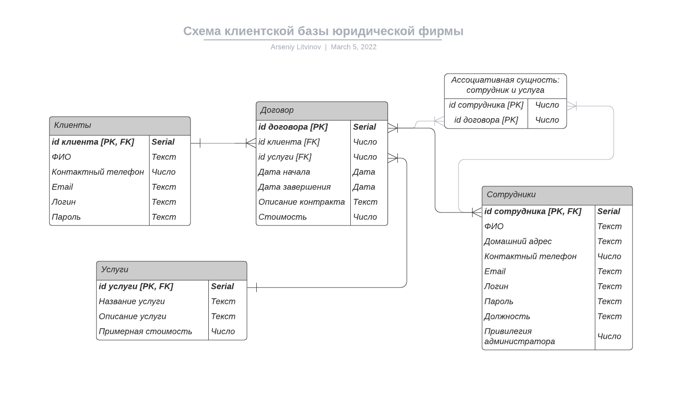

# Схема базы данных

# Схема навигации страниц

# Страницы приложения
### Главная страница
Шапка страницы
+ Кнопка для перехода на страницу регистрации или входа
+ Кнопка перехода на страницу информации о компании
+ Если пользователь авторизовался, то есть возможность перехода на страницу "личный кабинет"

Главная часть страницы
+ Каталог услуг, название вместе с описанием и ценами. Есть возможности фильтрации (например, отображение услуг в определённом интервале цен или только услуг, связанных с определённой областью, например, услуги с тегом "защита потребителей") и возможности настройки порядка отображения услуг в каталоге (по популярности / по цене | по убыванию / по возрастанию). Авторизованный клиент может заказать услугу, выбрав нужную в каталоге услуг
  
Внизу главной страницы (footer)
+ Информация о контактах фирмы (ссылки на соцсети) и адрес фирмы

### Страница информации о компании
Описывает компанию, её устройство и историю, лицензию на ведение юридической деятельности и другие юридические аспекты.

### Страница регистрации / входа
Для **регистрации** содержатся поля `имя`, `контактный телефон`, `email`, `логин` (здесь есть возможность позволить клиенту не придумывать логин, а использовать в качестве логина номер контактного телефон или адрес электронной почты), `пароль` и поле `подтверждение пароля`. Далее кнопка `регистрация`.

Для **авторизации уже существующей учётной записи** есть два поля: `логин` - в качестве логина используется контактный телефон или email и `пароль`. Далее кнопка `авторизация`.

### Страница личный кабинет клиента
*Эта страница доступна только тем, кто авторизовался как клиент.*

Наверху поля, отображающие информацию о клиенте, которые сам клиент может редактировать. Далее чуть ниже идёт список незаконченных услуг, а ещё ниже список завершённых услуг данного клиента.

### Страница личный кабинет сотрудника
*Эта страница доступна только тем, кто авторизовался как сотрудник.*

Наверху поля, отображающие информацию о сотруднике, которые сам сотрудник может редактировать. Далее список активных услуг: то есть тех, которые оказывает данный сотрудник на данный момент. Активную услугу служащий может завершить. Внизу список завершённых услуг данным сотрудником.

### Страница услуги
*Эта страница доступна только тем, кто авторизовался как сотрудник.*

На этой страницы отображаются все услуги клиентов. Есть возможность настройки параметров отображения: например, услуг, оказанных в определённый период времени, определёнными сотрудниками, определённым клиентам. Есть кнопка `добавить услугу`, к которой прилагаются поля: `логин клиента`, `участвующие сотрудники`, `тип услуги`. У сотрудника для каждой активной услуги есть кнопка `заняться услугой` или `перестать заниматься услугой`. Для активной (незавершённой) услуги у сотрудников есть возможность редактирования информации об услуги, например, её стоимости. Также у сотрудника есть кнопка `завершить услугу`, тогда услуга считается завершённой и отправляется в список завершённых услуг.

### Страница клиенты
*Эта страница доступна только тем, кто авторизовался как сотрудник.*

Отображает список всех клиентов и услуг, которые они заказывали. Служающие могут просматривать любую информацию о любом клиенте.

### Панель управления администраторов
*Эта страница доступна только администраторам.*

Кнопка регистрации нового служающего: поля информации о сотруднике (имя, пароль, контактный телефон, email, логин и пароль).

Есть полная возможность редактирования любой информации о сотрудниках, клиентах и услугах.

# Сценарии использования
Ниже приведены сценарии использования. Нашим сайтом будут пользоваться разные пользователи, их можно разделить на три категории, каждая категория имеет разные привелегии.

Администраторы базы имеют полный доступ ко всему, они могут просматривать / редактировать / удалять любую информацию о клиентах, сотрудниках и заказах.

Права клиентов и сотрудников фирмы планируется разграничивать с помощью учётных записей. Возможность создать аккаунт клиента есть у каждого, кто зайдёт на сайт. Возможность создать аккаунт сотрудника есть только у администратора.

### Примеры сценариев использования

**Для клиентов, зашедших на сайт**
+ Регистрация клиентом своего аккаунта
+ Просмотр каталога услуг (не требует регистрации)
+ Заказать новую юридическую услугу (требует регистрации)
+ Просмотреть информацию о всех предыдущих услугах своего акканута (требует регистрации)
+ Удаление клиентом своего аккаунта (требует регистрации)

**Сотрудники**
+ Создание учётной записи клиента
+ Добавление услуги к аккаунту клиента
+ Просмотр истории услуг любого клиента
+ Изменение информации своего аккаунта сотрудника

**Администраторы базы**

У администраторов базы есть полный доступ ко всей информации, ниже приведены наиболее важные операции, которые должны будут делать администраторы базы
+ Создание учётной записи для нового служающего
+ Изменение информации о любом сотруднике (сюда входит любая информация, связанная с сотрудником, а также есть вохможность изменения пароля)
+ Удаление информации о любом сотруднике
+ Добавление / изменение / удаление информации о клиентах
+ Добавление / изменение / удаление списка оказываемых или оказанных услуг
+ Добавление / изменение / удаление услуги в каталоге услуг